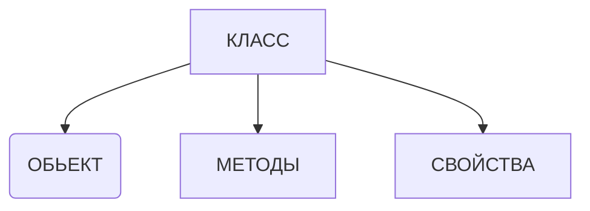

## 1: Построение абстракции
## 2: Наследование
## 3: Полиморфизм
## 4: Инкапсуляция

## Класс

## Модификаторы достпа
- private
- public

## Полиморфизм

- Параметрический (Истинный)
- ad-hoc (Мнимый)

## Взаимодействие между классами
[Просто о композиции, агрегации и ассоциации в JavaScript](https://webdevblog.ru/prosto-o-kompozicii-agregacii-i-associacii-v-javascript/)

Композиция, агрегация и ассоциация — все эти термины или точнее парадигмы ООП про отношения между объектами или классами
между собой. Всего существует пять основных типов отношений:

- Ассоциация
- Агрегарция
- Композиция
- Наследования (иногда этот тип еще называют генерализацией)
- Реализация 
  (это тип отношений базируется на интерфейсах. То есть создаетюся интерфейсы, которые основной класс должен реализовать.)

### Копозиция
Инициализируется внутри конструктора класса

### Агрегация
Передается через конструктор класса

### Ассоциации
