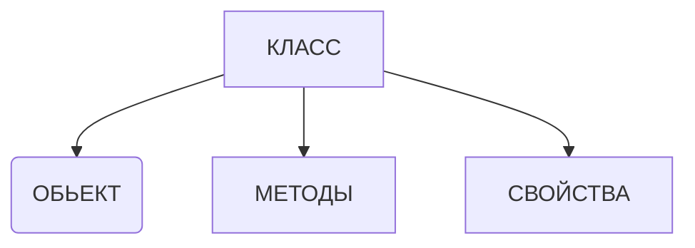

## 1: Построение абстракции
## 2: Наследование
## 3: Полиморфизм
## 4: Инкапсуляция

## Класс

```mermaid
graph TD;
  КЛАСС-->ЭКЗЕМЛЯР(ОБЬЕКТ);
  КЛАСС-->МЕТОДЫ;
  КЛАСС-->СВОЙСТВА;
```

## Модификаторы достпа
- private
- public
